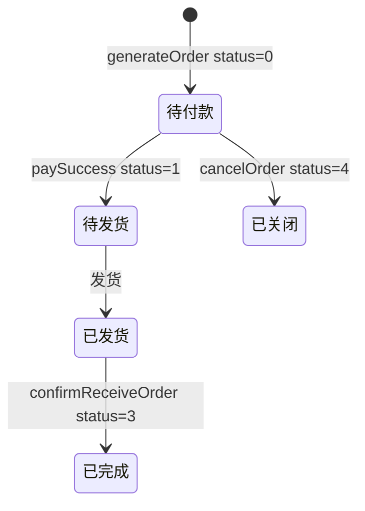
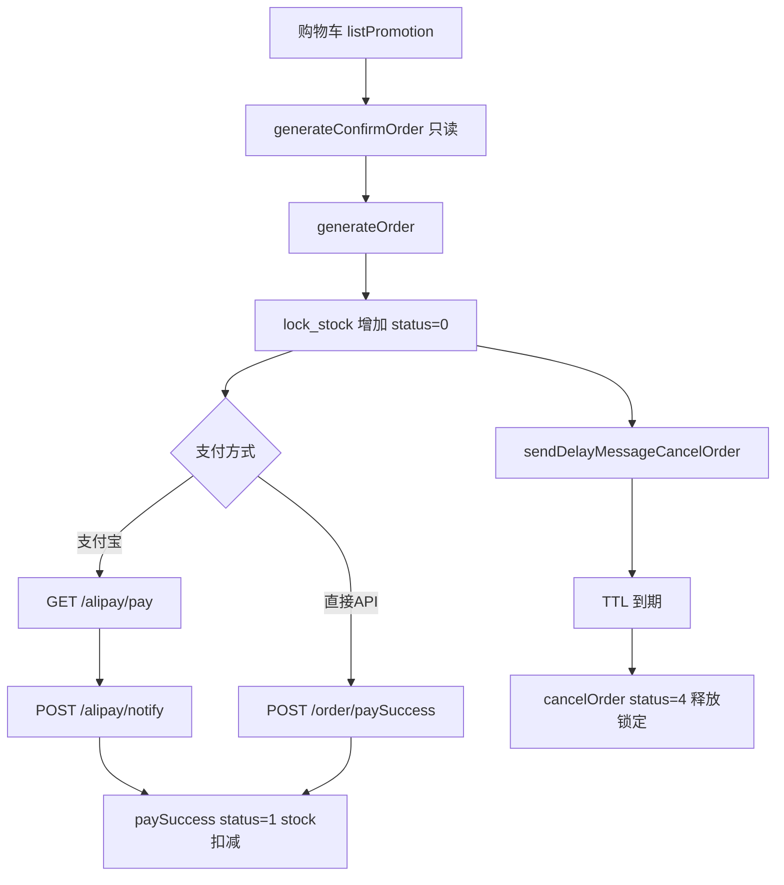

# T3：前台订单流程深读

> **场景**：模板场景三（流程深读）
> **生成时间**：2026-07-05
> **范围**：购物车 → 确认单 → 下单 → 库存锁定 → 支付 → 超时取消

---

## 1. 流程入口

- **购物车**：`OmsCartItemController`，`/cart/**`
- **订单**：`OmsPortalOrderController`，`/order/**`
- **支付**：`AlipayController`，`/alipay/**`
- **网关前缀**：`/mall-portal/**`，`StripPrefix=1`（`mall-gateway/application.yml` 第 32–37 行）

---

## 2. 输入数据

| 阶段 | 输入 | 关键字段 |
|------|------|----------|
| 确认单 | `List<Long> cartIds` | 购物车 ID 列表 |
| 下单 | `OrderParam` | `cartIds`, `memberReceiveAddressId`, `couponId`, `useIntegration`, `payType` |
| 支付回调 | 支付宝 notify | `out_trade_no`（orderSn）, `trade_status` |
| 直接支付成功 | query 参数 | `orderId`, `payType` |

---

## 3. 中间步骤（真实执行顺序）

### 阶段 1：购物车（只读）

```
POST /cart/add → cartItemService.add
GET /cart/list/promotion?cartIds= → listPromotion → calcCartPromotion（含 realStock = stock - lockStock）
```

证据：`OmsCartItemController.java` 第 31–55 行；`OmsCartItemServiceImpl.java` 第 82–91 行。

### 阶段 2：生成确认单（只读聚合）

```
POST /order/generateConfirmOrder
  → generateConfirmOrder(cartIds)
  → 当前会员 + listPromotion + 收货地址 + 可用优惠券 + 积分规则 + calcCartAmount
```

证据：`OmsPortalOrderController.java` 第 33–37 行；`OmsPortalOrderServiceImpl.java` 第 70–90 行。

**无 DB 写**；空购物车仍返回空列表。

### 阶段 3：生成订单（核心写链路，@Transactional）

```
POST /order/generateOrder
  → generateOrder(orderParam)
```

**校验分支**（失败 → `Asserts.fail` → `ApiException`）：

| 条件 | 消息 |
|------|------|
| 无收货地址 | 请选择收货地址！ |
| 库存不足 | 库存不足，无法下单 |
| 优惠券不可用 | 该优惠券不可用 |
| 积分不可用 | 积分不可用 |

**成功路径**：

1. `cartIds` → `listPromotion` → 构建 `OmsOrderItem` 列表
2. 优惠券/积分分摊
3. `lockStock`：`lock_stock += quantity`（SKU 锁定，stock 不变）
4. 组装 `OmsOrder`：`status=0` 待付款
5. `generateOrderSn`：Redis INCR
6. `insert oms_order + oms_order_item`
7. 优惠券 `useStatus=1`；扣会员积分
8. 软删购物车
9. `sendDelayMessageCancelOrder` → 发 MQ 延迟取消

证据：`OmsPortalOrderServiceImpl.java` 第 94–249 行。

### 阶段 4：超时取消（MQ 主路径）

**RabbitMQ 配置**（`RabbitMqConfig.java`）：

- TTL 交换机 `mall.order.direct.ttl` → 死信转发 → 消费队列 `mall.order.cancel`

**发送**（`sendDelayMessageCancelOrder`）：

- 读 `OmsOrderSetting.normalOrderOvertime`（分钟）
- `delayTimes = minute * 60 * 1000`
- `CancelOrderSender` 设置 `message.expiration`

**消费**（`CancelOrderReceiver`）：

- 监听 `mall.order.cancel`
- 调用 `cancelOrder(orderId)`

**cancelOrder 逻辑**（幂等）：

- 查 `id=orderId AND status=0 AND deleteStatus=0`
- 查不到 → **静默 return**（已支付/已取消）
- 更新 `status=4` 已关闭
- `releaseSkuStockLock`：减 `lock_stock`
- 恢复优惠券、返还积分

证据：`CancelOrderSender.java` 第 23–33 行；`CancelOrderReceiver.java` 第 16–24 行；`OmsPortalOrderServiceImpl.java` 第 297–324 行。

**备用：定时批量取消**（`OrderTimeOutCancelTask`）：

- **`//@Component` 被注释**，定时任务**默认不运行**
- 若启用：每 10 分钟 → `cancelTimeOutOrder`（批量 SQL 查超时单）

### 阶段 5：支付成功

**路径 A：直接 API**

```
POST /order/paySuccess?orderId=&payType=
  → status=1 待发货；paymentTime=now
  → updateSkuStock：stock-=qty, lock_stock-=qty
```

**风险**：`paySuccess` **不校验**当前 status，重复调用可能重复扣库存。

**路径 B：支付宝**

```
GET /alipay/pay → 返回 HTML 表单
POST /alipay/notify → RSA 验签
  ├─ 失败 → "failure"（支付宝重试）
  └─ TRADE_SUCCESS → paySuccessByOrderSn(outTradeNo, 1) → "success"
```

`paySuccessByOrderSn`：查 `orderSn + status=0`，有则 `paySuccess`；无则静默（防重复回调）。

证据：`AlipayController.java`；`AlipayServiceImpl.java` 第 72–95、423–433 行。

---

## 4. 状态变化

| status | 含义 | 写入点 |
|--------|------|--------|
| 0 | 待付款 | `generateOrder` |
| 1 | 待发货 | `paySuccess` |
| 3 | 已完成 | `confirmReceiveOrder`（本流程未展开） |
| 4 | 已关闭 | `cancelOrder` / 批量取消 |

**库存**：下单 `lock_stock↑`；支付 `stock↓, lock_stock↓`；取消 `lock_stock↓`。



---

## 5. 分支逻辑

| 分支点 | 条件 | 去向 |
|--------|------|------|
| 下单校验 | 地址/库存/券/积分 | 失败抛 `ApiException` |
| MQ 取消 | status≠0 | 静默跳过 |
| 支付宝 notify | 验签失败 / 非 TRADE_SUCCESS | 返回 failure |
| paySuccessByOrderSn | 订单非待付款 | 静默跳过 |
| `POST /order/cancelOrder` | — | **重发延迟 MQ**（非立即取消） |
| `POST /order/cancelUserOrder` | — | 立即 `cancelOrder` |

---

## 6. 外部依赖

| 依赖 | 用途 |
|------|------|
| MySQL | oms_order、oms_order_item、pms_sku_stock |
| Redis | 订单号 INCR（`oms:orderId`） |
| RabbitMQ | 延迟取消订单 |
| 支付宝沙箱 | 在线支付 |

---

## 7. 失败处理

| 场景 | 处理 |
|------|------|
| 下单校验失败 | `Asserts.fail` → 事务回滚 |
| MQ 发送失败 | 事务已提交但无延迟消息，依赖手动 `cancelTimeOutOrder` 补救 |
| 支付回调验签失败 | 返回 failure，支付宝重试 |
| 重复 MQ 消费 | `cancelOrder` 幂等（status≠0 跳过） |

---

## 8. 输出结果

- 下单成功：`CommonResult.success(result, "下单成功")`，含 orderId 等
- 支付成功：订单 status=1，库存正式扣减
- 超时取消：status=4，锁定库存释放，优惠券/积分返还

---

## 9. 流程图



---

## 10. 可提炼候选

| # | 候选 | 层级 |
|---|------|------|
| 1 | 下单事务内锁库存（lock_stock）+ 支付后扣 stock | 方案层 |
| 2 | RabbitMQ TTL 死信队列实现订单超时取消 | 方案层 |
| 3 | cancelOrder 幂等：status≠0 静默跳过 | 原子层 |
| 4 | paySuccessByOrderSn 防重复支付回调 | 原子层 |
| 5 | 定时批量取消与 MQ 单条取消双通道（定时默认未启用） | 方案层 |

---

## 11. 证据列表

- `mall-portal/.../controller/OmsCartItemController.java`
- `mall-portal/.../controller/OmsPortalOrderController.java`
- `mall-portal/.../service/impl/OmsPortalOrderServiceImpl.java`
- `mall-portal/.../config/RabbitMqConfig.java`
- `mall-portal/.../domain/QueueEnum.java`
- `mall-portal/.../component/CancelOrderSender.java`
- `mall-portal/.../component/CancelOrderReceiver.java`
- `mall-portal/.../component/OrderTimeOutCancelTask.java`
- `mall-portal/.../controller/AlipayController.java`
- `mall-portal/.../service/impl/AlipayServiceImpl.java`
- `mall-portal/src/main/resources/dao/PortalOrderDao.xml`

---

## 12. 未确认 / 需注意

| 项 | 说明 |
|----|------|
| `OrderTimeOutCancelTask` | `@Component` 被注释，定时批量取消默认不运行 |
| `POST /order/cancelOrder` | 命名像取消，实际重发延迟 MQ |
| `paySuccess` 直接 API | 无 status 校验，存在重复扣库存风险 |
| MQ 发送失败 | 无补偿机制，依赖手动触发批量取消 |
