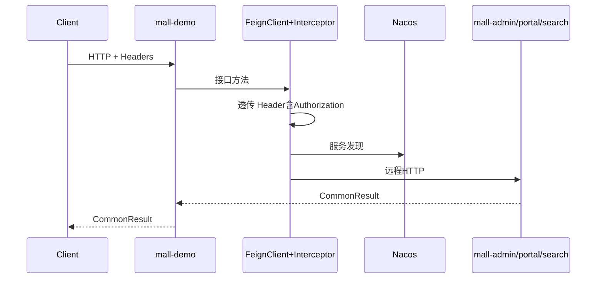

# T7：mall-demo Feign 跨服务调用深读

> **场景**：模板场景二（模块深读）
> **生成时间**：2026-07-05
> **范围**：FeignRequestInterceptor token 透传、三条调用链

---

## 1. 模块背景

`mall-demo`（端口 8082）是微服务远程调用演示服务，展示如何通过 OpenFeign + Nacos 服务发现调用 admin/portal/search，并透传 HTTP Header（含 Authorization token）。

## 2. 核心职责

| 负责 | 不负责 |
|------|--------|
| Feign 调用示例 | 业务逻辑 |
| Header 透传（含 token） | 认证签发 |
| 验证跨服务 CommonResult 返回 | 网关鉴权 |

## 3. 核心对象

| 对象 | 路径 | 作用 |
|------|------|------|
| `MallDemoApplication` | `mall-demo/.../MallDemoApplication.java` | `@EnableFeignClients` + `@EnableDiscoveryClient` |
| `FeignConfig` | `mall-demo/.../config/FeignConfig.java` | Logger.FULL + 注册 Interceptor |
| `FeignRequestInterceptor` | `mall-demo/.../component/FeignRequestInterceptor.java` | 透传当前请求全部 Header |
| `FeignAdminService` | `mall-demo/.../service/FeignAdminService.java` | `@FeignClient("mall-admin")` |
| `FeignPortalService` | `mall-demo/.../service/FeignPortalService.java` | `@FeignClient("mall-portal")` |
| `FeignSearchService` | `mall-demo/.../service/FeignSearchService.java` | `@FeignClient("mall-search")` |
| `FeignAdminController` 等 | `mall-demo/.../controller/` | Demo HTTP 入口 |

## 4. 内部流程

### 4.1 Header 透传（认证链关键）

`FeignRequestInterceptor.apply`（第 17–34 行）：

```java
// 遍历当前 HttpServletRequest 全部 Header
// 跳过 content-length（防流异常）
requestTemplate.header(name, values);
```

**效果**：客户端带的 `Authorization: Bearer xxx` 会原样转发到下游服务。

### 4.2 三条 Feign 调用链

| Demo 入口 | Feign Client | 目标 | 下游路径 |
|-----------|--------------|------|----------|
| `POST /feign/admin/login` | FeignAdminService | mall-admin | `POST /admin/login` |
| `GET /feign/admin/getBrandList` | 同上 | mall-admin | `GET /brand/listAll` |
| `POST /feign/portal/login` | FeignPortalService | mall-portal | `POST /sso/login` |
| `GET /feign/portal/cartList` | 同上 | mall-portal | `GET /cart/list` |
| `GET /feign/search/justSearch` | FeignSearchService | mall-search | `GET /esProduct/search/simple` |

### 4.3 调用时序



## 5. 对外接口

| Controller | 路径前缀 | 说明 |
|------------|----------|------|
| `FeignAdminController` | `/feign/admin` | admin 登录、品牌列表 |
| `FeignPortalController` | `/feign/portal` | portal 登录、购物车 |
| `FeignSearchController` | `/feign/search` | 简单搜索 |
| `DemoController` | `/demo` | 本地 CRUD 演示 |

网关路由：`/mall-demo/**` → `lb://mall-demo`，StripPrefix=1。

## 6. 扩展点

- 新增 Feign 客户端：定义 `@FeignClient` 接口 + Controller 包装
- 自定义 Header 过滤：修改 `FeignRequestInterceptor`

## 7. 错误处理

- Feign 调用失败：Spring Cloud 默认行为，无 Fallback
- 下游返回 `CommonResult` 原样透传

## 8. 设计优点

- Interceptor 全量 Header 透传，登录后带 token 调下游无需额外配置
- 三条链覆盖 admin（需鉴权）、portal（需登录）、search（白名单）典型场景

## 9. 设计代价

- 全量 Header 透传可能带入无关头或敏感信息
- 无 Feign Fallback，下游不可用直接失败

## 10. 可提炼候选

| # | 候选 | 层级 |
|---|------|------|
| 1 | FeignRequestInterceptor 透传 Authorization 实现跨服务认证 | 方案层 |
| 2 | 跳过 content-length 防 Feign 流异常 | 原子层 |
| 3 | @EnableFeignClients + Nacos 服务发现标准组合 | 方案层 |

## 11. 已读证据

- `mall-demo/src/main/java/com/macro/mall/MallDemoApplication.java`
- `mall-demo/src/main/java/com/macro/mall/demo/config/FeignConfig.java`
- `mall-demo/src/main/java/com/macro/mall/demo/component/FeignRequestInterceptor.java`
- `mall-demo/src/main/java/com/macro/mall/demo/controller/FeignAdminController.java`
- `mall-demo/src/main/java/com/macro/mall/demo/controller/FeignPortalController.java`
- `mall-demo/src/main/java/com/macro/mall/demo/controller/FeignSearchController.java`
- `mall-demo/src/main/java/com/macro/mall/demo/service/FeignAdminService.java`
- `mall-demo/src/main/java/com/macro/mall/demo/service/FeignPortalService.java`
- `mall-demo/src/main/java/com/macro/mall/demo/service/FeignSearchService.java`

## 12. 待深读问题

1. mall-auth 的 Feign 调用是否也需要类似 Interceptor（auth 转发登录时无 token）
