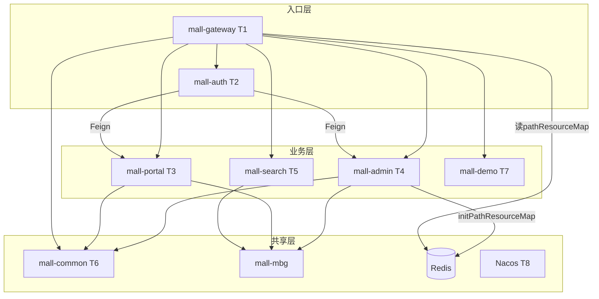

# mall-swarm 深读索引

> 总纲见 [项目总纲.md](../项目总纲.md)
> 生成时间：2026-07-05

## 深读文档列表

| 编号 | 文档 | 场景 | 优先级 | 一句话 |
|------|------|------|--------|--------|
| T1 | [T1-mall-gateway深读.md](T1-mall-gateway深读.md) | 场景二 | P0 | 网关路由、Sa-Token 双体系鉴权、Redis 路径权限 OR |
| T2 | [T2-mall-auth登录链深读.md](T2-mall-auth登录链深读.md) | 场景二 | P0 | clientId 路由 + Feign 转发 + 双 StpLogic 签发 token |
| T3 | [T3-订单流程深读.md](T3-订单流程深读.md) | 场景三 | P0 | 购物车→下单→锁库存→支付→MQ 超时取消 |
| T4 | [T4-mall-admin权限深读.md](T4-mall-admin权限深读.md) | 场景二 | P0 | 启动预热 Redis 路径规则 + 登录加载 permissionList |
| T5 | [T5-mall-search深读.md](T5-mall-search深读.md) | 场景二 | P1 | 手动 MySQL→ES 同步 + function_score 综合搜索 |
| T6 | [T6-mall-common深读.md](T6-mall-common深读.md) | 场景二 | P1 | CommonResult 统一响应 + Redis 封装 + 认证常量 |
| T7 | [T7-mall-demo深读.md](T7-mall-demo深读.md) | 场景二 | P1 | Feign Header 透传 Authorization 跨服务调用 |
| T8 | [T8-Nacos配置缺口核实.md](T8-Nacos配置缺口核实.md) | 核查 | P1 | mall-auth 缺 dev/prod 模板，monitor 未接 Nacos Config |

## 模块关系（深读后确认）

## 下一步（模板场景 4A/4B/4C）

**已完成**：经验已入库并经 **落地审计 + 终检对照**（2026-07-05），共 **31 条**，见 [经验总目录](../经验/总目录.md)（含 ✅/⚠️/🚫 图例）。

### 深读候选 → 经验库对照（终检）

| 深读 | 候选 | 入库文档 | 状态 |
|------|------|----------|------|
| **T1** | 网关集中鉴权 + 双 StpLogic | 架构/网关集中鉴权与双账号体系分离 | ✅ |
| T1 | 白名单外置 YAML | 方案/网关路径白名单外置配置 | ✅ |
| T1 | Redis Hash + Ant OR | 方案/基于Redis的路径级权限OR校验 + 阶段1-3 | ✅ |
| T1 | Portal checkLogin+stop | 并入网关 ADR §4-5 | ✅ 合并 |
| T1 | 401/403 统一映射 | 方案/鉴权异常统一映射401403响应 | ✅ |
| T1 | —（深读未列） | 方案/网关mall-demo路径未匹配登录校验 | ✅ 补充 |
| **T2** | clientId + Feign 登录聚合 | 架构/统一登录聚合服务 | ✅ |
| T2 | 双 loginType 隔离 JWT | 并入网关 ADR + StpMemberUtil 证据 | ✅ 合并 |
| T2 | Session 写 adminInfo/permissionList | 方案/登录态写入Token Session供网关消费 | ✅ |
| T2 | 权限码 id:name 同源 | 阶段3 + 登录态方案 §permissionList | ✅ 合并 |
| T2 | token + tokenHead 格式 | 方案/统一登录响应token与tokenHead格式 | ✅ |
| **T3** | 锁库存 + 支付扣减 | 方案/下单事务内锁库存与支付后扣减 | ✅ |
| T3 | RabbitMQ TTL 超时取消 | 方案/RabbitMQ TTL… + 阶段1-2 | ✅ |
| T3 | cancelOrder 幂等 | 阶段2-幂等取消执行 | ✅ |
| T3 | paySuccessByOrderSn 幂等 | 方案/支付回调按订单号幂等确认 | ✅ |
| T3 | 定时+MQ 双通道 | RabbitMQ 父方案（定时 `@Component` 关闭） | ✅ |
| T3 | —（深读 §12） | 陷阱-cancelOrder接口名与行为不一致 | ✅ 补充 |
| **T4** | 启动预热 Redis | 阶段1-Redis路径规则预热 | ✅ |
| T4 | 资源 CRUD 刷新 | 阶段1 + 补充-initPathResourceMap调用时机清单 | ✅ |
| T4 | Session permissionList | 阶段3-登录Session写入权限列表 | ✅ |
| T4 | Ant OR 匹配 | 阶段2-网关Ant路径OR匹配 | ✅ |
| **T5** | 手动 MySQL→ES 同步 | 方案/手动API触发关系库到搜索引擎同步 | ✅ |
| T5 | function_score 加权 | 方案/function_score…（含 recommend） | ✅ |
| T5 | Nested 属性聚合 | 方案/Nested聚合筛选商品属性 | ✅ |
| T5 | Repository + Template 分工 | 方案/Repository与Template分场景访问ES | ✅ |
| **T6** | CommonResult | 方案/CommonResult统一API响应封装 | ✅ |
| T6 | Asserts → ApiException 链 | 方案/业务断言失败经全局异常转响应 | ✅ |
| T6 | BaseRedisConfig + RedisService | 方案/BaseRedisConfig与RedisService封装 | ✅ |
| T6 | AuthConstant | 方案/跨服务认证契约常量集中定义 | ✅ |
| **T7** | Feign Header 透传 | 方案/Feign请求头透传（**仅 mall-demo**） | ✅ |
| T7 | 跳过 content-length | 原子/阶段1-跳过content-length头透传 | ✅ |
| T7 | EnableFeignClients + Nacos | 方案/EnableFeignClients与Nacos服务发现调用 | ✅ |
| **T8** | Nacos 配置缺口 | 方案/Nacos配置缺口与运维注意 | ✅ |

### 有意保留在深读、未单独成卡

| 项 | 原因 |
|----|------|
| `requestPath` 是否含 `/mall-admin` 前缀 | 未运行时实测，不宜写入经验 |
| Feign `ApiException` 跨服务传播 | 深读待确认，代码未梳理完整链路 |
| `WebLogAspect` IP 字段取值问题 | 代码瑕疵备注，非可复用方案 |
| Seata / 微信 / OAuth2 | 文档有、代码无，总目录标 🚫 |
