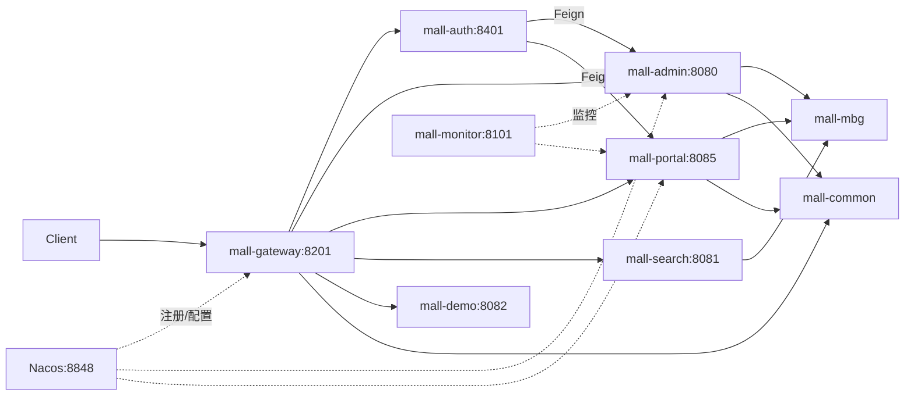

# mall-swarm 项目总纲

> **文档性质**：场景一产出，只建地图，不提炼经验。
> **生成时间**：2026-07-05
> **阅读约束**：已应用模板第 0 节防偷懒规则；每条判断附证据或标注「未确认」/「路径待核实」。

---

## 1. 项目背景

**解决什么问题**

一套微服务电商后端系统，覆盖后台管理（商品/订单/促销/内容/用户/权限）与前台商城（搜索/购物车/下单/支付/会员）完整业务链路，并集成注册中心、配置中心、网关、监控等基础设施。

**证据**：`README.md` 第 21–23 行项目简介；`document/reference/dev_flow.md` 后台与前台功能清单。

**面向什么用户**

- 学习 Spring Cloud 微服务架构的开发者（附带在线教程与视频）
- 需要快速搭建电商系统的二次开发者

**证据**：`README.md` 第 15–18 行（在线体验、学习教程、视频教程链接）。

**典型使用场景**

- 通过网关（8201）统一访问各微服务 API
- 后台管理员通过 `mall-admin` 管理商品与订单
- 前台会员通过 `mall-portal` 浏览商品、下单、支付
- 商品搜索通过 `mall-search` 查询 Elasticsearch 索引

**关联前端项目（不在本仓库）**

- 后台前端：`mall-admin-web`（README 第 29 行）
- 前台商城：`mall-app-web`（README 第 37 行）

---

## 2. 技术栈

### 后端核心（已核实 pom.xml 与 README）

| 技术 | 版本/说明 | 证据 |
|------|-----------|------|
| Java | 17 | `pom.xml` 第 37 行 `java.version` |
| Spring Boot | 3.5.14 | `pom.xml` 第 28、38 行 |
| Spring Cloud | 2025.0.2 | `pom.xml` 第 39 行 |
| Spring Cloud Alibaba | 2025.0.0.0 | `pom.xml` 第 40 行 |
| Sa-Token | 1.42.0 | `pom.xml` 第 57 行；各服务 `application.yml` 中 `sa-token` 配置块 |
| MyBatis + PageHelper | 3.0.4 / 2.1.1 | `pom.xml` 第 41–42 行 |
| MyBatis Generator | 1.4.2 | `pom.xml` 第 45 行；`mall-mbg` 模块 |
| Nacos | 注册 + 配置中心 | 各服务 `application-dev.yml` 中 `spring.cloud.nacos` |
| Spring Cloud Gateway | 网关 | `mall-gateway/pom.xml`；`application.yml` routes 配置 |
| OpenFeign | 服务间调用 | `mall-auth` 的 `@FeignClient`；`mall-admin` `@EnableFeignClients` |
| Redis | 缓存/权限规则 | `mall-gateway`、`mall-admin`、`mall-portal` 的 `spring.data.redis` |
| Elasticsearch | 商品搜索 | `mall-search/application.yml` 第 28–29 行 `spring.elasticsearch.uris` |
| RabbitMQ | 订单超时取消 | `mall-portal/application.yml` 第 35–40 行；`CancelOrderSender/Receiver` |
| MongoDB | 会员行为数据 | `mall-portal/application.yml` 第 25–28 行 `spring.data.mongodb` |
| MySQL | 主数据库 | `document/sql/mall.sql`；各服务 datasource 配置 |
| Knife4j + SpringDoc | API 文档 | 根 `pom.xml` knife4j/springdoc 版本；网关聚合 `knife4j.gateway` |
| Druid | 连接池 | `mall-admin/application.yml` 第 15–23 行 |
| Docker / K8s | 部署 | `document/docker/`、`document/k8s/` |

### 中间件版本（README 推荐开发环境）

MySQL 5.7、Redis 7.0、Elasticsearch 7.17.3、MongoDB 5.0、RabbitMQ 3.10.5、Nginx 1.22（`README.md` 第 123–133 行）。

### 文档与 README 不一致处（已确认）

| 文档描述 | 实际代码 | 状态 |
|----------|----------|------|
| README 第 59 行：mall-auth 基于 Spring Security OAuth2 | 代码使用 Sa-Token + Feign 转发 | **文档过时** |
| `deploy_windows.md` 第 17–25 行：mall-registory、mall-config 模块 | 仓库无此模块，使用 Nacos 替代 | **文档过时** |
| `dev_flow.md` 技术选型写 Spring Security | 当前 master 分支用 Sa-Token | **文档过时** |

---

## 3. 核心模块地图

共 9 个 Maven 子模块 + 1 个配置目录，不超过 10 项。

### 3.1 mall-common（库模块，P1 深读）

| 项 | 内容 |
|----|------|
| 职责 | 通用 API 封装、Redis 服务、认证常量、全局异常处理、Web 日志切面 |
| 关键路径 | `mall-common/src/main/java/com/macro/mall/common/`（15 个 Java 文件） |
| 核心类 | `CommonResult`、`CommonPage`、`AuthConstant`、`GlobalExceptionHandler`、`RedisService` |
| 模块关系 | 被 mall-auth、mall-gateway、mall-admin 等依赖 |
| 是否深读 | P1 — 理解统一返回格式与认证常量 |

### 3.2 mall-mbg（库模块，P2 深读）

| 项 | 内容 |
|----|------|
| 职责 | MyBatis Generator 生成的 Mapper/Model，共享数据访问层 |
| 关键路径 | `mall-mbg/src/main/java/com/macro/mall/mapper/`（约 76 个 Mapper）；`mall-mbg/src/main/resources/com/macro/mall/mapper/*.xml` |
| 代码生成 | `mall-mbg/src/main/java/com/macro/mall/Generator.java` |
| 模块关系 | 被 mall-admin、mall-portal、mall-search、mall-demo 依赖 |
| 是否深读 | P2 — 按需查表结构对应关系即可 |

### 3.3 mall-gateway（可运行，P0 深读）

| 项 | 内容 |
|----|------|
| 职责 | API 网关：路由转发、Sa-Token 鉴权、权限校验、API 文档聚合 |
| 入口 | `mall-gateway/src/main/java/com/macro/mall/MallGatewayApplication.java` |
| 端口 | 8201（`application.yml` 第 2 行） |
| 核心类 | `SaTokenConfig.java`、`IgnoreUrlsConfig.java`、`StpInterfaceImpl.java`、`StpMemberUtil.java` |
| 模块关系 | 上游入口；下游 lb 到 auth/admin/portal/search/demo |
| 是否深读 | **P0** — 鉴权与白名单是全局入口 |

### 3.4 mall-auth（可运行，P0 深读）

| 项 | 内容 |
|----|------|
| 职责 | 统一认证入口，按 clientId 路由到 admin 或 portal 登录 |
| 入口 | `mall-auth/src/main/java/com/macro/mall/auth/MallAuthApplication.java` |
| 端口 | 8401（`application.yml` 第 2 行） |
| 核心类 | `AuthController`（`/auth/login`）、`UmsAdminService`（Feign→mall-admin）、`UmsMemberService`（Feign→mall-portal） |
| 模块关系 | 网关白名单 `/mall-auth/**`；不直接连数据库 |
| 是否深读 | **P0** — 统一认证 Feign 转发模式 |

### 3.5 mall-admin（可运行，P0 深读）

| 项 | 内容 |
|----|------|
| 职责 | 后台管理：商品(Pms)、订单(Oms)、促销(Sms)、内容(Cms)、用户权限(Ums)、文件上传 |
| 入口 | `mall-admin/src/main/java/com/macro/mall/MallAdminApplication.java`（`@EnableFeignClients`、`@EnableDiscoveryClient`） |
| 端口 | 8080 |
| 核心包 | `controller`（31 个）、`service`/`service.impl`、`dao`、`config`、`component/PathResourceRulesHolder` |
| 模块关系 | 依赖 mall-mbg；启动时初始化 Redis 路径-权限映射；被 mall-auth Feign 调用 |
| 是否深读 | **P0** — 后台核心业务 + 权限资源初始化 |

### 3.6 mall-portal（可运行，P0 深读）

| 项 | 内容 |
|----|------|
| 职责 | 前台商城：首页、商品、购物车、订单、支付、会员 SSO、收藏/足迹（MongoDB） |
| 入口 | `mall-portal/src/main/java/com/macro/mall/portal/MallPortalApplication.java` |
| 端口 | 8085 |
| 核心包 | `controller`（13 个）、`service`、`dao`、`repository`（MongoDB）、`component`（MQ 取消订单）、`config`（RabbitMq/Alipay 等） |
| 外部依赖 | MySQL + Redis + MongoDB + RabbitMQ + 支付宝 SDK |
| 是否深读 | **P0** — 购物流程与订单超时取消 |

### 3.7 mall-search（可运行，P1 深读）

| 项 | 内容 |
|----|------|
| 职责 | Elasticsearch 商品搜索：导入、创建、删除、简单/综合搜索 |
| 入口 | `mall-search/src/main/java/com/macro/mall/search/MallSearchApplication.java` |
| 端口 | 8081 |
| 核心类 | `EsProductController`（`/esProduct`）、`EsProductService`、`EsProductDao`、`EsProductRepository` |
| 模块关系 | 依赖 mall-mbg 读 MySQL，写 ES；网关白名单 `/mall-search/**` |
| 是否深读 | P1 — MySQL→ES 同步与搜索 |

### 3.8 mall-monitor（可运行，P2 深读）

| 项 | 内容 |
|----|------|
| 职责 | Spring Boot Admin 监控中心 |
| 入口 | `mall-monitor/src/main/java/com/macro/mall/MallMonitorApplication.java` |
| 端口 | 8101；登录 `macro:123456`（`application.yml` 第 7–9 行） |
| 核心类 | `SecuritySecureConfig`、`CustomCsrfFilter` |
| 是否深读 | P2 — 运维监控，非核心业务 |

### 3.9 mall-demo（可运行，P1 深读）

| 项 | 内容 |
|----|------|
| 职责 | Feign 远程调用演示 |
| 入口 | `mall-demo/src/main/java/com/macro/mall/MallDemoApplication.java` |
| 端口 | 8082 |
| 核心类 | `FeignAdminController`、`FeignPortalController`、`FeignSearchController`、`FeignRequestInterceptor` |
| 是否深读 | P1 — 作为 Feign 调用链参考示例 |

### 3.10 config/（配置目录，P1 了解）

| 项 | 内容 |
|----|------|
| 职责 | Nacos 待导入的外部化配置（dev/prod） |
| 已有文件 | admin、gateway、portal、search、demo 各 dev+prod 共 10 个 YAML |
| 缺失 | **无** `config/auth/`、`config/monitor/`；但 `mall-auth/application-dev.yml` 引用了 `nacos:mall-auth-dev.yaml`（**配置缺失，未确认是否影响启动**） |

---

## 4. 整体架构判断（待深读，不下定论）

### 4.1 最核心的抽象（初步观察）

- **按业务域拆分的微服务**：admin（后台）、portal（前台）、search（搜索）、auth（认证）、gateway（入口）
- **共享数据层 mall-mbg**：多服务共用同一套 MyBatis Mapper，无独立数据库 per service
- **网关统一鉴权**：Sa-Token 在 gateway 层拦截，admin 用 `StpUtil`，portal 用 `StpMemberUtil`
- **认证中心纯转发**：mall-auth 无数据库，通过 Feign 委托 admin/portal 执行实际登录

### 4.2 分层 / 模块边界

典型调用链：`Controller → Service → Dao/Mapper（mall-mbg 或自定义 dao.xml）→ MySQL`

### 4.3 一眼可见的重大设计取舍

| 取舍 | 观察到的做法 | 待深读问题 |
|------|-------------|-----------|
| 微服务 vs 单体数据 | 服务拆分但共享 `mall` 数据库与 mall-mbg | 是否有分布式事务（README 提 Seata，pom 未核实是否引入） |
| 认证方案 | Sa-Token + 网关鉴权 + Redis 权限规则缓存 | JWT 集成方式（`sa-token-jwt` 依赖在 gateway/admin）、双 StpUtil 隔离机制 |
| 配置管理 | Nacos 外部化 + 本地 application.yml 默认值 | auth/monitor 无 config/ 目录 YAML 的影响 |
| 搜索架构 | 独立 search 服务 + ES，手动 import API 同步 | 是否有自动同步/CDC，还是纯手动触发 |
| 异步解耦 | RabbitMQ 延迟队列取消超时订单 | 延迟时间来源、与 `oms_order_setting` 的关联 |
| API 文档 | Knife4j 网关服务发现聚合 | 各服务独立 springdoc 配置 |

---

## 5. 主流程识别

### 5.1 流程一：网关路由 + 鉴权（P0）

| 项 | 内容 |
|----|------|
| 入口 | `mall-gateway/src/main/resources/application.yml` routes（第 19–49 行） |
| 鉴权 | `SaTokenConfig.java`：`StpMemberUtil.checkLogin()` 匹配 `/mall-portal/**`；`StpUtil.checkLogin()` 匹配 `/mall-admin/**`；Redis `auth:pathResourceMap` 做权限 OR 校验 |
| 白名单 | `secure.ignore.urls`（application.yml 第 58–79 行） |
| 网关前缀 | 所有路由 `StripPrefix=1`，外部路径 `/mall-admin/xxx` → 内部 `/xxx` |

### 5.2 流程二：统一认证（P0）

| 项 | 内容 |
|----|------|
| 入口 | `AuthController.login()` — `POST /auth/login`，参数 `clientId/username/password` |
| 分支 | `clientId=admin-app` → `UmsAdminService.login()` Feign `POST mall-admin/admin/login`；`clientId=portal-app` → `UmsMemberService.login()` Feign `POST mall-portal/sso/login` |
| 常量 | `AuthConstant.ADMIN_CLIENT_ID`、`PORTAL_CLIENT_ID`（`mall-common/.../AuthConstant.java` 第 22–27 行） |

### 5.3 流程三：前台会员 SSO（P0）

| 项 | 内容 |
|----|------|
| 入口 | `UmsMemberController` — `/sso/login`、`/sso/register`、`/sso/getAuthCode`、`/sso/logout` |
| 返回 | 登录成功返回 `{token, tokenHead}`，tokenHead 来自 `sa-token.token-prefix`（默认 `Bearer`） |
| 网关 | `/sso/login`、`/sso/register`、`/sso/getAuthCode` 在白名单，无需登录 |

### 5.4 流程四：购物车 → 订单 → 超时取消（P0）

| 项 | 内容 |
|----|------|
| 购物车入口 | `OmsCartItemController` — `/cart/add`、`/cart/list` 等 |
| 订单入口 | `OmsPortalOrderController` — `/order/generateConfirmOrder`、`/order/generateOrder`、`/order/paySuccess` |
| 订单状态 | Controller 注释：0 待付款、1 待发货、2 已发货、3 已完成、4 已关闭（第 73 行） |
| 异步取消 | `CancelOrderSender.sendMessage(orderId, delayTimes)` → TTL 队列 `mall.order.direct.ttl`；`CancelOrderReceiver` 监听 `mall.order.cancel` 调用 `portalOrderService.cancelOrder()` |
| 队列定义 | `QueueEnum.java`：exchange `mall.order.direct.ttl`，routeKey `mall.order.cancel.ttl` |

### 5.5 流程五：商品 MySQL → ES 搜索（P1）

| 项 | 内容 |
|----|------|
| 入口 | `EsProductController` — `/esProduct/importAll`、`/esProduct/create/{id}`、`/esProduct/search` |
| 分层 | `EsProductService` → `EsProductDao`（MyBatis 读 MySQL）+ `EsProductRepository`（Spring Data ES） |
| 网关 | `/mall-search/**` 整体白名单，搜索接口无需登录 |

### 5.6 备选流程

| 流程 | 入口 | 优先级 |
|------|------|--------|
| 支付宝支付 | `AlipayController` — `/alipay/pay`、`/alipay/webPay`；白名单 `/mall-portal/alipay/**` | P1 |
| 后台商品管理 | `PmsProductController` + `PmsProductService` | P1 |
| 后台权限初始化 | `PathResourceRulesHolder.initPathResourceMap()` → `UmsResourceService` | P0（与网关鉴权联动） |
| Feign 调用演示 | `mall-demo` 的 `FeignAdminController` 等 | P2 |

---

## 6. 阅读优先级

### P0 必须读

1. `mall-gateway` — 路由、白名单、Sa-Token 鉴权、Redis 权限规则匹配
2. `mall-auth` — 统一认证 Feign 转发
3. `mall-admin` — 后台登录、权限资源初始化（`PathResourceRulesHolder`）
4. `mall-portal` — SSO、购物车、订单、MQ 超时取消
5. 流程深读：「前台下单 → 支付 → 超时取消」完整链路

### P1 建议读

1. `mall-search` — MySQL→ES 导入与搜索
2. `mall-common` — CommonResult、AuthConstant、全局异常
3. `mall-demo` — Feign 调用与拦截器
4. `config/` + 各服务 `application-dev.yml` — Nacos 配置全貌
5. 支付流程（`AlipayController` + `AlipayService`）

### P2 暂时可不读

1. `mall-monitor` — 标准 Spring Boot Admin 集成
2. `mall-mbg` 全部 Mapper — 按需查阅
3. `document/pdm/` — 数据库设计源文件
4. `document/elk/` — ELK 示例配置
5. 后台促销/内容管理细节 — 非核心架构路径

---

## 7. 暂不阅读范围

| 范围 | 原因 |
|------|------|
| `document/pdm/mall.pdm`、`mall.pdb` | 二进制/专用格式，已有 `mall.sql` 可查表结构 |
| `document/elk/` | 日志收集示例，与核心业务链路无关 |
| `document/resource/` | 目录当前仓库缺失（README 引用图片路径 glob 为 0） |
| `deploy_windows.md` 中 mall-registory/mall-config 章节 | 模块已不存在，描述过时 |
| `mall-mbg` 全部 76 个 Mapper 实现 | 生成代码，按业务按需查阅 |
| 前端项目 mall-admin-web / mall-app-web | 不在本仓库 |
| Seata 分布式事务 | README 提及，根 pom 未核实是否实际引入 |

---

## 8. 已确认事实

1. **9 个 Maven 子模块**：common、mbg、auth、gateway、admin、portal、search、monitor、demo（`pom.xml` 第 12–22 行）
2. **网关端口 8201**，路由 5 条服务，均 `StripPrefix=1`（`mall-gateway/application.yml`）
3. **Nacos 地址 localhost:8848**，admin/gateway/portal/search/demo 通过 `spring.config.import` 加载 Nacos 配置（各 `application-dev.yml`）
4. **认证框架为 Sa-Token**，非 Spring Security OAuth2（gateway `SaTokenConfig`、各服务 `sa-token` 配置块）
5. **mall-auth 无数据库依赖**，通过 Feign 调用 admin/portal（`UmsAdminService`、`UmsMemberService` 接口定义）
6. **权限规则存 Redis**，key 为 `auth:pathResourceMap`（`AuthConstant.PATH_RESOURCE_MAP`）；admin 启动时 `PathResourceRulesHolder` 初始化
7. **共享数据库 mall**，表前缀：cms_、oms_、pms_、sms_、ums_（`document/sql/mall.sql` CREATE TABLE 语句）
8. **订单超时取消使用 RabbitMQ 延迟队列**，TTL 通过 `message.getMessageProperties().setExpiration()` 设置（`CancelOrderSender.java` 第 29 行）
9. **根 POM 默认跳过测试** `<skipTests>true</skipTests>`（`pom.xml` 第 34 行）
10. **config/ 目录无 auth、monitor 的 YAML**，但 mall-auth 引用了 `mall-auth-dev.yaml`（仅 `application-dev.yml` 第 11 行引用，文件不存在）

---

## 9. 推测和未确认问题

| 编号 | 问题 | 状态 |
|------|------|------|
| Q1 | mall-auth 启动时缺少 `mall-auth-dev.yaml` 是否导致 Nacos 配置加载失败或仅告警 | **未确认** — config/ 无对应文件 |
| Q2 | 订单超时取消的 `delayTimes` 具体值来源（是否读 `oms_order_setting.normal_order_overtime`） | **未确认** — 未读 `OmsPortalOrderServiceImpl` |
| Q3 | 商品变更后 ES 是否自动同步，还是仅通过 `/esProduct/create/{id}` 手动触发 | **未确认** — 未读 admin 商品保存逻辑 |
| Q4 | Seata 全局事务是否实际集成（README 技术表列出，根 pom 未核实） | **未确认** |
| Q5 | `StpMemberUtil` 与 `StpUtil` 如何实现双账号体系隔离 | **未确认** — 仅见 gateway 调用 |
| Q6 | 网关权限校验中 `pathMatcher.match(pattern, requestPath)` 的 requestPath 是否含 `/mall-admin` 前缀 | **未确认** — 需运行时或深读 SaHolder 行为 |
| Q7 | README 架构图 `document/resource/mall_micro_service_arch.jpg` 是否存在 | **路径待核实** — glob 0 文件 |
| Q8 | dev_flow.md 中「集成 SpringCloud」勾选未完成，是否指历史单体 mall 迁移状态 | **推测** — 当前已是微服务结构 |

---

## 10. 深读任务（已完成）

8 项深读均已完成，文档见 [深读索引.md](深读/深读索引.md)：

| 序号 | 文档 | 场景 | 状态 |
|------|------|------|------|
| T1 | [T1-mall-gateway深读.md](深读/T1-mall-gateway深读.md) | 场景二 | ✅ 已完成 |
| T2 | [T2-mall-auth登录链深读.md](深读/T2-mall-auth登录链深读.md) | 场景二 | ✅ 已完成 |
| T3 | [T3-订单流程深读.md](深读/T3-订单流程深读.md) | 场景三 | ✅ 已完成 |
| T4 | [T4-mall-admin权限深读.md](深读/T4-mall-admin权限深读.md) | 场景二 | ✅ 已完成 |
| T5 | [T5-mall-search深读.md](深读/T5-mall-search深读.md) | 场景二 | ✅ 已完成 |
| T6 | [T6-mall-common深读.md](深读/T6-mall-common深读.md) | 场景二 | ✅ 已完成 |
| T7 | [T7-mall-demo深读.md](深读/T7-mall-demo深读.md) | 场景二 | ✅ 已完成 |
| T8 | [T8-Nacos配置缺口核实.md](深读/T8-Nacos配置缺口核实.md) | 核查 | ✅ 已完成 |

**下一步**：经验已入库并经落地审计 + 终检对照（**31 条**），见 [工程经验库/经验/总目录.md](../经验/总目录.md)（含 ✅/⚠️/🚫 图例）及 [深读索引](深读/深读索引.md) 候选对照表。

---

## 附录 A：已阅读文件列表

### 项目级

- `README.md`
- `pom.xml`（前 180 行 + 模块列表）
- `document/reference/dev_flow.md`
- `document/reference/function.md`
- `document/reference/deploy_windows.md`
- `document/sql/mall.sql`（前 80 行 + CREATE TABLE grep）
- `document/docker/docker-compose-env.yml`（前 50 行）
- `document/docker/docker-compose-app.yml`（前 40 行）
- `config/gateway/mall-gateway-dev.yaml`
- `config/admin/mall-admin-dev.yaml`
- `config/portal/mall-portal-dev.yaml`

### 各模块配置

- `mall-gateway/src/main/resources/application.yml`、`application-dev.yml`
- `mall-auth/src/main/resources/application.yml`、`application-dev.yml`
- `mall-admin/src/main/resources/application.yml`、`application-dev.yml`
- `mall-portal/src/main/resources/application.yml`
- `mall-search/src/main/resources/application.yml`
- `mall-monitor/src/main/resources/application.yml`
- `mall-demo/src/main/resources/application.yml`

### 核心源码

- `mall-gateway/.../MallGatewayApplication.java`
- `mall-gateway/.../SaTokenConfig.java`
- `mall-auth/.../MallAuthApplication.java`
- `mall-auth/.../AuthController.java`
- `mall-auth/.../UmsAdminService.java`
- `mall-auth/.../UmsMemberService.java`
- `mall-admin/.../MallAdminApplication.java`
- `mall-admin/.../UmsAdminController.java`（前 50 行）
- `mall-admin/.../PathResourceRulesHolder.java`
- `mall-portal/.../MallPortalApplication.java`
- `mall-portal/.../UmsMemberController.java`（前 80 行）
- `mall-portal/.../OmsCartItemController.java`（前 60 行）
- `mall-portal/.../OmsPortalOrderController.java`（前 80 行）
- `mall-portal/.../AlipayController.java`（前 50 行）
- `mall-portal/.../CancelOrderSender.java`
- `mall-portal/.../CancelOrderReceiver.java`
- `mall-portal/.../QueueEnum.java`
- `mall-search/.../MallSearchApplication.java`
- `mall-search/.../EsProductController.java`（前 80 行）
- `mall-common/.../AuthConstant.java`
- mall-common 包下 15 个 Java 文件（glob 确认）
- mall-admin controller 31 个文件（glob 确认）
- mall-portal controller 13 个文件（glob 确认）
- mall-demo controller 4 个文件（glob 确认）
- mall-mbg mapper 约 76 个（grep count 确认）

---

## 附录 B：未阅读但可能重要的文件

| 文件 | 重要原因 |
|------|----------|
| `mall-gateway/.../StpMemberUtil.java` | 前台会员鉴权核心 |
| `mall-gateway/.../StpInterfaceImpl.java` | Sa-Token 权限接口实现 |
| `mall-gateway/.../IgnoreUrlsConfig.java` | 白名单配置绑定 |
| `mall-admin/.../SaTokenConfigure.java` | 后台 Sa-Token 配置 |
| `mall-admin/.../UmsResourceServiceImpl.java` | 路径-权限 Redis 初始化逻辑 |
| `mall-portal/.../OmsPortalOrderServiceImpl.java` | 下单/支付/取消完整实现 |
| `mall-portal/.../RabbitMqConfig.java` | 延迟队列交换机/绑定声明 |
| `mall-portal/.../OrderTimeOutCancelTask.java` | 定时扫描超时订单 |
| `mall-search/.../EsProductServiceImpl.java` | ES 导入与搜索实现 |
| `mall-demo/.../FeignRequestInterceptor.java` | Feign token 透传 |
| `config/search/mall-search-dev.yaml` | ES 连接外部化配置 |
| `config/demo/mall-demo-dev.yaml` | demo 服务外部化配置 |
| `document/k8s/*.yaml` | K8s 部署拓扑细节 |
| 各服务 `application-prod.yml` | 生产环境差异 |

---

## 附录 C：下一步建议深读文件（按 T1–T3 优先级）

1. `mall-gateway/src/main/java/com/macro/mall/config/SaTokenConfig.java`
2. `mall-gateway/src/main/java/com/macro/mall/util/StpMemberUtil.java`
3. `mall-auth/src/main/java/com/macro/mall/auth/controller/AuthController.java`
4. `mall-admin/src/main/java/com/macro/mall/component/PathResourceRulesHolder.java`
5. `mall-portal/src/main/java/com/macro/mall/portal/service/impl/OmsPortalOrderServiceImpl.java`
6. `mall-portal/src/main/java/com/macro/mall/portal/config/RabbitMqConfig.java`
7. `mall-portal/src/main/java/com/macro/mall/portal/component/CancelOrderSender.java`
8. `mall-portal/src/main/java/com/macro/mall/portal/component/CancelOrderReceiver.java`
