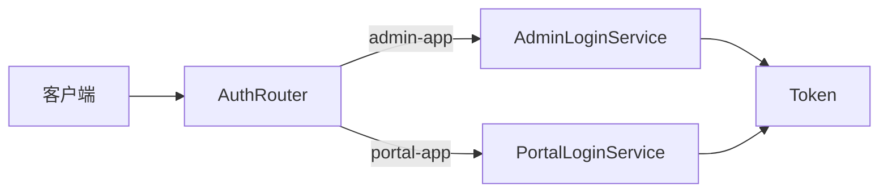

# 统一登录聚合服务（clientId 路由到领域服务）

> **命名说明**：本项目 `mall-auth` 仅实现登录转发，并非完整 OAuth/认证中心。下文「聚合服务」指其实际能力边界。

## 本项目落地状态

| 维度 | 状态 |
|------|------|
| 代码位置 | `mall-auth`：仅 `AuthController` 一个 `POST /auth/login` |
| 默认是否启用 | ✅ 已启用（需 Nacos + admin/portal 可达） |
| 未实现能力 | 无 refresh/logout/register 聚合；无 token 刷新；README 写的 OAuth2 **与代码不符**（实际 Sa-Token） |
| 并存路径 | 客户端也可直连 `/mall-admin/admin/login`、`/mall-portal/sso/login`（白名单） |
| 配置缺口 | `mall-auth-dev.yaml` 在 `config/` **不存在**，dev 启动依赖 Nacos 容错 |

## 1. 背景与场景

多客户端（管理端 App、前台商城 App）需要统一登录 URL，但用户数据与密码校验逻辑分属不同领域服务，登录聚合服务不想重复维护用户库。

## 2. 要解决的核心问题

- 客户端面对多个登录地址，集成复杂
- 认证中心复制用户表：数据双写、密码同步困难
- 完全 OAuth2 授权服务器：过重，学习成本高

## 3. 可选方案

| 方案 | 做法 |
|------|------|
| A. 客户端直连各领域登录 API | 简单，无统一入口 |
| B. 完整 OAuth2/OIDC 授权服务器 | 标准，组件重 |
| C. 轻量登录聚合 + clientId 路由 + Feign 委托 | 单入口，按 clientId 转发到领域服务执行登录 |

## 4. 决策与理由

选 **C**：认证服务无数据库，仅提供 `POST /auth/login`，根据 `clientId` 调用 Feign：
- `admin-app` → 后台服务 `POST /admin/login`
- `portal-app` → 前台服务 `POST /sso/login`
- 其他 → 明确失败 `clientId不正确`

放弃 B：电商演示/中小型项目不需要完整 OAuth2。保留 A 作为并存白名单直连路径。

## 5. 核心抽象

**AuthRouter**：`(clientId, credentials) → route(ClientProfile) → DomainLoginService.login() → Token`

## 6. 通用结构图

## 7. 适用条件

- 2~5 个固定客户端类型，非动态第三方 OAuth 客户端
- 领域服务已具备登录 API 与 token 签发能力
- 服务发现可用（Feign + 注册中心）

## 8. 不适用 / 反例

- 大量第三方应用动态注册 client
- 需要 authorization_code、refresh_token 等标准 OAuth 流程
- 登录聚合服务需离线校验用户（无 Feign 可达领域服务）

## 9. 已知代价

- 三条登录路径并存（auth 聚合 + 领域直连），白名单需同步
- Feign 失败无 Fallback 时登录不可用
- clientId 硬编码在常量中，新增客户端需改代码

## 10. 落地要点

1. 定义 `ClientProfile` 常量（clientId → 目标服务 + 登录路径）
2. 登录聚合服务只做路由，不连用户库
3. 领域服务负责 BCrypt 校验、状态检查、StpLogic 登录
4. 网关将 `/auth/**` 加入白名单
5. 统一返回 `{token, tokenHead}` 格式

## 11. 标签

architecture, auth, feign, client-id, bff

## 附录：来源证据（仅供溯源核实，阅读正文无需依赖此节）

- `AuthController.java` L37-49：clientId 三分支
- `UmsAdminService.java`：`@FeignClient("mall-admin")` `POST /admin/login`
- `UmsMemberService.java`：`@FeignClient("mall-portal")` `POST /sso/login`
- `AuthConstant.java` L22-27：`admin-app` / `portal-app`
