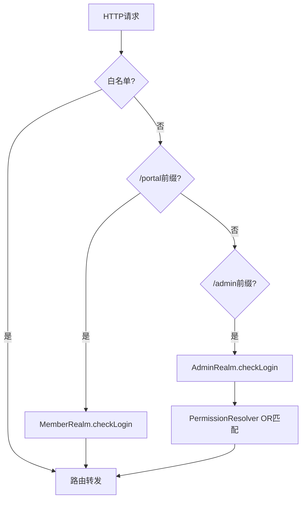

# 网关集中鉴权与双账号体系分离

## 本项目落地状态

| 维度 | 状态 |
|------|------|
| 代码位置 | `mall-gateway/SaTokenConfig.java` + `application.yml` 白名单 |
| 默认是否启用 | ✅ 主业务路径已启用（admin/portal 经网关鉴权） |
| 已验证机制 | portal `checkLogin`+stop；admin `checkLogin`+Redis 权限 OR |
| 待确认 | 网关无 `jwt-secret-key`；`requestPath` 与 Redis key 前缀对齐需实测 |
| 已知缺口 | `/mall-demo/**` 无 checkLogin → 见 [网关mall-demo路径未匹配登录校验](../方案/认证/网关mall-demo路径未匹配登录校验.md) |

## 1. 背景与场景

多客户端系统（管理后台 + 前台用户）共用一套 API 网关，需要统一入口鉴权，同时避免后台权限模型污染前台、前后台 token 互相冒充。

## 2. 要解决的核心问题

- 每个业务服务各自鉴权：规则分散、白名单难同步、重复实现
- 单一 token 体系：前台 token 可能访问后台接口，或反之
- 不做网关鉴权：下游服务必须全部实现登录校验，且暴露面扩大

## 3. 可选方案

| 方案 | 做法 |
|------|------|
| A. 各服务自鉴权 | 每个微服务集成安全过滤器 |
| B. 网关统一鉴权 + 单 token | 网关一处校验，所有用户同一 StpLogic |
| C. 网关统一鉴权 + 双 loginType | 网关按路径前缀选用不同 StpLogic，同一 Redis Session 存储 |

## 4. 决策与理由

选 **C**：在 API 网关注册全局 `SaReactorFilter`，对 `/portal/**` 前缀走会员 `StpMemberUtil`（独立 `loginType=memberLogin`），对 `/admin/**` 走默认 `StpUtil`；会员路径 `checkLogin` 后 `.stop()` 不再做细粒度权限，后台路径继续 Redis 路径权限 OR 校验。

**本项目边界**：`mall-gateway` 无 `jwt-secret-key` 配置（admin/portal 为 `sa-secret-key123`），JWT 校验行为需运行时确认；`/mall-demo/**` 不在白名单且不走 portal/admin 的 `checkLogin`，若 Redis 无匹配规则则可能无需登录即可访问。

放弃 A：规则重复、白名单多处维护。放弃 B：无法隔离前后台 token 命名空间。

## 5. 核心抽象

**GatewayAuthFilter**：全局过滤器 = 白名单排除 + 按路径前缀选择 AccountRealm（会员/管理员）+ 可选 PermissionResolver（仅管理员）。

## 6. 通用结构图

## 7. 适用条件

- 有统一 API 网关（Spring Cloud Gateway / Kong / Nginx+Lua 等）
- 前台仅需登录门槛，后台需 RBAC
- 认证框架支持多 loginType 或等价隔离（如 Sa-Token 双 StpLogic）
- 网关与业务服务共享 Session 存储（如 Redis）

## 8. 不适用 / 反例

- 每个服务需不同鉴权算法且无法统一过滤器
- 强需求：前台也要接口级权限（本模式前台 stop 后不做权限块）
- 无网关、客户端直连微服务

## 9. 已知代价

- 网关成为鉴权单点；规则变更需同步白名单配置
- 路径前缀约定必须稳定（`/admin/**` vs `/portal/**`）
- 网关需访问 Redis 读权限规则；与权限管理服务耦合

## 10. 落地要点

1. 定义路径前缀与账号体系映射表（portal→会员，admin→管理员）
2. 网关注册全局过滤器，白名单外置配置
3. 会员体系使用独立 loginType 签发 JWT
4. 管理员登录时将权限列表写入 Token Session
5. 网关对管理员路径做路径-权限 OR 匹配（见关联方案卡）

## 11. 标签

architecture, gateway, authentication, multi-realm, sa-token

## 附录：来源证据（仅供溯源核实，阅读正文无需依赖此节）

- `mall-gateway/.../SaTokenConfig.java` L47-53：portal `StpMemberUtil.checkLogin().stop()`，admin `StpUtil.checkLogin()`
- `mall-gateway/.../StpMemberUtil.java` L44-49：`TYPE=memberLogin`，`StpLogicJwtForSimple(TYPE)`
- `mall-admin/.../SaTokenConfigure.java` L17-20：默认 `StpLogicJwtForSimple()` 供 admin
