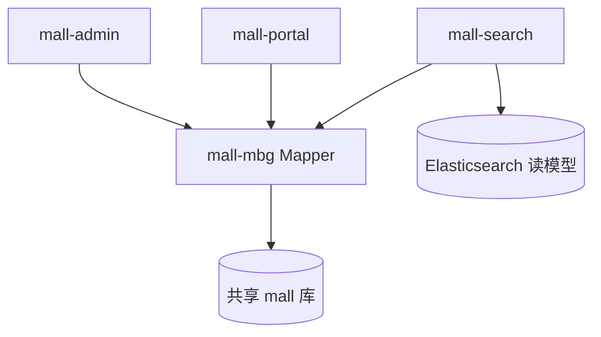

# 逻辑微服务与共享单库数据访问

## 本项目落地状态

| 维度 | 状态 |
|------|------|
| 代码事实 | admin/portal/search/demo 共用 `mall-mbg` + 同一 `mall` 库 |
| 项目性质 | **教学/演示型**微服务拆分，非生产级独立库架构 |
| 未引入 | Seata（README 提及，**pom 无依赖**）；商品变更 **不会** 自动同步 ES |
| 默认是否启用 | ✅ 按此结构运行 |

## 1. 背景与场景

电商系统按业务域拆分为 admin（后台）、portal（前台）、search（搜索）等可部署单元，团队希望获得微服务独立发布与网关路由的好处，但数据模型高度耦合（订单、商品、用户同库）。

## 2. 要解决的核心问题

- 单体部署：无法按域独立扩缩容
- 每服务独立数据库：跨域 JOIN 消失，分布式事务成本高
- 完全重写数据层：迁移成本不可接受

## 3. 可选方案

| 方案 | 做法 |
|------|------|
| A. 保持单体 | 一个 WAR/JAR |
| B. 每服务独立库 + 事件同步 | 真微服务数据隔离 |
| C. 逻辑微服务 + 共享 schema + 共享 ORM 模块 | 服务拆分，共用 `mall` 库与 Generator 生成的 Mapper |

## 4. 决策与理由

选 **C**：9 个 Maven 模块中 admin/portal/search/demo 依赖 `mall-mbg`（MyBatis Generator 生成的 Mapper/Model），全部指向同一 `mall` 数据库（`jdbc:mysql://.../mall`）。搜索服务额外维护 ES 索引，通过 API 手动同步。

放弃 B：订单-商品-库存强一致场景多，Seata 等未作为默认路径。选 C 换取**部署独立、数据访问简单**，接受**库级耦合**。

## 5. 核心抽象

**SharedDataModule**：独立 jar 承载 GeneratedMapper + Entity，被多个 DeployableService 依赖；各服务自有 `dao/*.xml` 扩展复杂查询。

## 6. 通用结构图

## 7. 适用条件

- 从单体演进的教学/中小型电商
- 数据强关联、跨域事务以本地 `@Transactional` 为主
- 团队规模小，可接受 schema 变更需多服务协调发布

## 8. 不适用 / 反例

- 多团队独立演进 schema
- 需严格故障隔离（一服务拖垮库影响全部）
- 合规要求数据域物理隔离

## 9. 已知代价

- schema 变更影响所有依赖 mbg 的服务
- 无法按服务独立备份恢复单域数据
- 搜索等读模型需额外同步机制（非 CDC 时为手动 API）

## 10. 落地要点

1. 抽取 `*-mbg` 或 `*-dao` 共享模块，Generator 集中生成
2. 各服务 `mapper-locations` 同时扫描共享 xml 与本地 `dao/*.xml`
3. 按域拆可运行服务，但 datasource 指向同一库
4. 读模型（ES）通过显式 import API 同步，不假设自动 CDC
5. 分布式事务仅在跨库/跨资源时再引入

## 11. 标签

architecture, microservice, shared-database, mybatis-generator

## 附录：来源证据（仅供溯源核实，阅读正文无需依赖此节）

- 根 `pom.xml` modules：mall-mbg 被 admin/portal/search/demo 依赖
- `document/sql/mall.sql`：单库表前缀 cms_/oms_/pms_/sms_/ums_
- 各服务 `application.yml` datasource url 均为 `.../mall`
